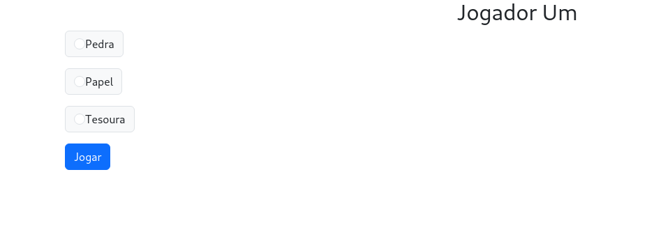

# Jokenpo Online

Este é um projeto ambicioso baseado em uma ideia compartilhada por um primo. Diferente do meu projeto anterior de Jokenpo contra o computador, este utiliza um servidor NodeJS para permitir a interação entre dois jogadores.

## Complicações

Infelizmente, para testar o projeto completamente, é necessário que ele esteja hospedado na web, embora ainda seja possível testá-lo localmente. O uso entre máquinas diferentes é viável através de um serviço de hospedagem.

## Tecnologias
- HTML
- CSS
- JavaScript
- Node.js
- Express
- Bootstrap

## Screenshots





## Como Testar Localmente

### Clone este repositório para o seu ambiente local:
   ```bash
   git clone https://github.com/seu-usuario/seu-repositorio.git
   cd seu-repositorio
```

### Instale as dependencias se necessario
```
    npm install express 

    npm install ejs 

    npm install sequelize

    npm install mysql2
```

### Inicialize o projeto
```
    node app
```
### Vá para o navegador e entre em seu localhost acessando a porta 3000 ou a especificada em app.js
```
    http://localhost:3000/
```